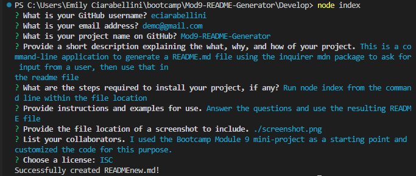

# Mod9-README-Generator

## Description
This is a command-line application to generate a README.md file using the inquirer mdn package to ask for input from a user, then use that in the readme file

## Table of Contents
- [Installation](#installation)
- [Usage](#usage)
- [Credits](#credits)
- [License](#license)
- [Questions](#questions)

## Installation
Run node index from the command line within the file location
- [Repository on GitHub](https://github.com/eciarabellini/Mod9-README-Generator)
- [Webpage on GitHub Pages](https://eciarabellini.github.io/Mod9-README-Generator) //!!!! remove if not applicable!!!

## Usage
Answer the questions and use the resulting README file
- 
- [video recording](https://drive.google.com/file/d/1NeDdqNG39CnTfWVGW5lV9ZlcZcxiVu6Q/view)

## Credits
I used the Bootcamp Module 9 mini-project as a starting point and customized the code for this purpose.

## License
ISC

## Questions
[GitHub Profile](https://github.com/eciarabellini)

